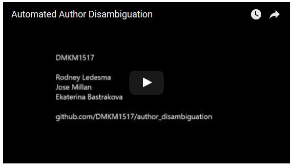

# Author Disambiguation

Author disambiguation is an open issue in the world of academic digital libraries. As many problems arise when trying to identify if two different authors are the same and then group them, this issue has become more relevant inside the scientific community. This work illustrates a workflow that aims to solve this issue. By using the best of a relational database engine and data mining techniques implemented in R, we have implemented a workflow that correctly disambiguates authors present in papers retrieved from the Internet. To evaluate the results we perform a two-step-validation process inside the workflow, validating if two articles were written by the same author, and, if so, validating the authors grouped together as an unique disambiguated author. With the validations performed, the workflow implemented allows the process of identifying and disambiguating a new author.

The article ​**Ekaterina Bastrakova, Rodney Ledesma, & Jose Millan. (2016). Author Disambiguation. University Lumiere Lyon 2**​ can be found [here](https://fruct.org/publications/AINL-FRUCT-2016/files/Bas.pdf)

A web application was also developed as the result of a Case Study Project based on this work. The following video is a demo of the application.

For more information please check the technical documentation [here](http://author-disambiguation.readthedocs.io/en/latest/). If you want to test the application, or you have any other question, please contact us to [dmkm.author.disambiguation@gmail.com](dmkm.author.disambiguation@gmail.com).
